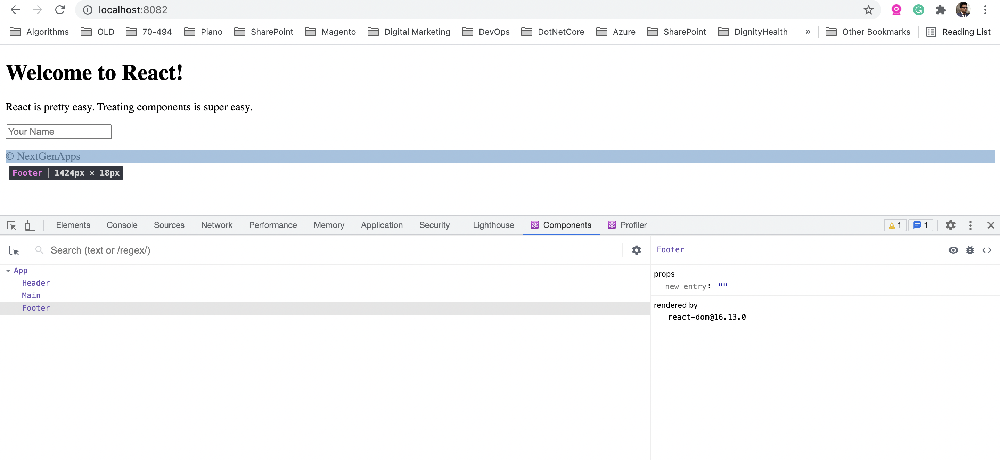

# Tutorial 1
In this, we created a few simple components and understood that

- React is a library and we used three scripts here
- Top level React library
- Library containing DOM specific methods
- Babel Compiler that will let you use ES6 is old browsers as well

- [React Dev Tools Extension](https://chrome.google.com/webstore/detail/react-developer-tools/fmkadmapgofadopljbjfkapdkoienihi?hl=en)

- Install the above extension and inspect and you should see the components you created in dev tools.
